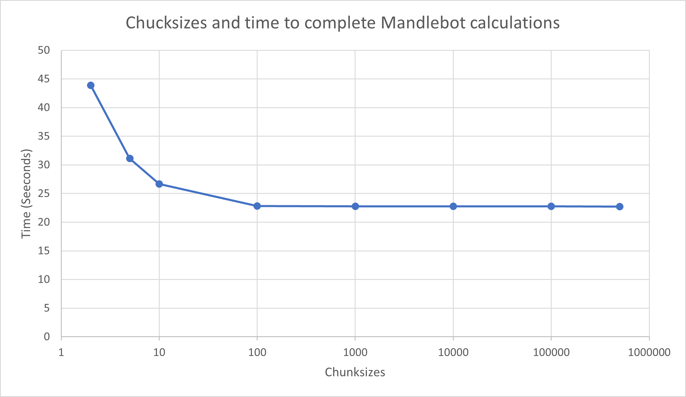
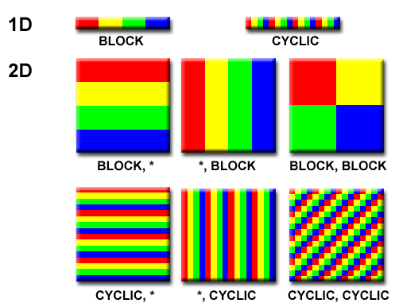

# Parallel Programming with MPI
**Student**: Caleb Lim   
**Student Number**: 19754532  
**Email**: 19754532@student.curtin.edu   

- [Parallel Programming with MPI](#parallel-programming-with-mpi)
  - [1. Introduction](#1-introduction)
  - [2. Block Partitioning](#2-block-partitioning)
      - [Code Overview](#code-overview)
      - [Results](#results)
  - [3. Master-Worker Implementation](#3-master-worker-implementation)
      - [Main](#main)
      - [Master Function](#master-function)
      - [Worker Function](#worker-function)
      - [Results](#results-1)
  - [4. Cyclic Distribution](#4-cyclic-distribution)
      - [Code Overview](#code-overview-1)
      - [Results](#results-2)
      - [Comparision with Block Distribution](#comparision-with-block-distribution)
      - [Another Implemention](#another-implemention)
  - [Overall](#overall)

## 1. Introduction
The language I used for the implementation of the game of life for MPI mandlebot code is C.

To compile the files I used:
```bash
> cc mandlebot.c 
> srun -p work --reservation=CurtinHPC -A courses0100 -n 10 a.out
```

A baseline was determined by running the Mandlebot set serial code which gave an average time of **225.985 seconds** to complete 


## 2. Block Partitioning
The objective of this task is to implement the Mandelbrot set using block partitioning with 10 processes on an 8000x8000 matrix.

#### Code Overview
First, the MPI (Message Passing Interface) library is initialised, and the rank and number of processes are determined. If the number of processes is not 10, an error message is displayed, and the program terminates.

Next step is to divide the matrix into 10 even rectangular strips, the total number of cells `N*N`is divided by the number of processes (10) to calculate the number of cells `numCells` in each strip. The start and end index of which each process is responsible the for loop is detemined by the rank. For example for rank 1 it is responsible for calculating the array between index 0 and 6,399,999 and for rank 2 it is responsible for calculating between 6,400,000 and 12,799,999 and so on and so forth.

Within the computation loop, each process calculates the Mandelbrot set values for its assigned cells. The row (i) and column (j) indices are used to compute the complex numbers, and the iterations are performed until the conditions are met. 

Process 0 (rank 0) gathers all the computed values from other processes using MPI_Gather. The gathered values are stored in the finalArray, which is allocated to accommodate the values for the entire matrix.

``` C
    /* Each process should split the array into segements of N/10 rows */
    /* Split the grid into 10 equal segments */
    numCells = (N*N)/ncpu;
    
    // Now we need to find the start and end index for each process for the for loop
    start = rank * numCells;
    end = start + numCells;

        ...

    //Calculate Mandlebot Set
        ...

    // Use MPI Gather get the processes answer the a final array
    float *finalArray;
    if(rank==0){
        finalArray = (float *) malloc(N*N*sizeof(float));
    }
    MPI_Gather(x,numCells,MPI_FLOAT,finalArray,numCells,MPI_FLOAT,0,MPI_COMM_WORLD);
```

#### Results
The overall code achieved a time of **80.09 seconds** to complete the Mandlebot set with no errors (checked by using diff with the serial code). Implementing block partitioning over 10 processes was a 64.56% time decrease compared to the serial version. The results are shown below

``` bash
> srun -p work --reservation=CurtinHPC -A courses0100 -n 10 a.out
Process elapsed time for RANK 0: 0.221975 seconds
Process elapsed time: 80.090236 seconds
Process elapsed time for RANK 1: 1065.474381 seconds
Process elapsed time for RANK 3: 1096.865890 seconds
Process elapsed time for RANK 5: 1144.082442 seconds
Process elapsed time for RANK 7: 1066.781818 seconds
Process elapsed time for RANK 9: 1065.408215 seconds
Process elapsed time for RANK 4: 1144.644235 seconds
Process elapsed time for RANK 6: 1097.165826 seconds
Process elapsed time for RANK 8: 1065.470710 seconds
Process elapsed time for RANK 2: 1066.761400 seconds
Writing mandelbrot.ppm
```

The provided output shows a significant load imbalance between the different processes. The elapsed times for each process vary greatly, ranging from 0.221975 seconds for process 0 to as high as 1144.644235 seconds for process 4. This indicates a significant difference in the computational workload across the processes.

The load imbalance can be attributed to the nature of the Mandelbrot set computation. The workload distribution among the processes is not uniform, as the complexity of the computation varies depending on the region of the set being calculated. Consequently, some processes may have to perform more iterations or handle more complex calculations than others, leading to the observed load imbalance.

However even though there large time seprations, it is relatively consistent between all processes. This is because the load imbalance observed in the parallel implementation is somewhat mitigated by the fact that the workload is evenly divided into 10 blocks. This means that each process is assigned an equal number of cells to compute. If the workload was not evenly divided due to a different number of processes or a grid size that is not a multiple of 10, the load imbalances would have been even more pronounced. Uneven blocks would lead to some processes having to handle significantly larger or more complex computations, further exacerbating the load imbalance issue. 

In comparison to the serial version, the parallel implementation with block partitioning and MPI shows a considerable improvement in terms of overall computation time. The parallel version achieved a speedup by distributing the workload among multiple processes.

To further optimise the parallel implementation, load balancing techniques can be employed to distribute the workload more evenly among the processes. This could involve dynamically adjusting the partitioning strategy based on the complexity of the computation or implementing load balancing algorithms to redistribute tasks among processes during runtime. For example using techniques such as cyclic distribution can help minimise load imbalance and improve the overall efficiency and scalability of the parallel implementation.


## 3. Master-Worker Implementation
The master-worker implementation of the Mandelbrot set involves a singular process acting as the master, which delegates work to multiple worker nodes. The master process is responsible for gathering the results from the workers and formatting them into the final matrix representing the Mandelbrot set. Each worker node is assigned a small segment of the Mandelbrot set to calculate, and once completed, it sends the calculated segment back to the master process for aggregation.

In this implementation, we used one master and 10 worker nodes. The code consists of two main functions: `master()` and `worker()`, as well as the `main()` function.

  **For this process set 11 processes**
``` bash
> cc mandlebot2.c
> srun -p work --reservation=CurtinHPC -A courses0100 -n 11 a.out
```
#### Main 
The main() function initializes the MPI environment, retrieves the rank and number of processes, and ensures that the code is executed with exactly 11 processes. The root process (rank 0) is designated as the master process, while the other processes are designated as worker processes. The master process invokes the master() function, and the worker processes invoke the worker() function. Finally, the MPI environment is finalized, and the program terminates.

#### Master Function
In the master() function, the master process is responsible for coordinating the distribution of work to the worker processes and gathering the results. The master process starts by allocating memory for the grid, which will store the Mandelbrot set data. It then sends the index of the starting cell of each chunk to each worker processes using MPI_Send.

The master process then enters a loop where it continuously receives results from the worker processes. Upon receiving a result indicated by using the `MPI_Iprobe` function, it extracts the starting index and the corresponding grid data from the received chunk and stores it in the appropriate location in the grid. The master process then sends the next chunk of work to the worker process that just finished its previous task. This process continues until all the work and proccess is completed. This is indicated by master sending a `DIETAG` tag that will indicate the workers to close the process. 

After the work distribution is complete, the master process proceeds to write the calculated Mandelbrot set data into a PPM file named "q2-8000x8000.ppm" using the gathered grid data.

``` C
void master() {

    ...
    //send first few jobs over
    for(i=1; i<ncpus; i++){
        // printf("SENDING CHUNK TO %d STARTING AT INDEX %d\n", i, grid_size);
        MPI_Send(   &grid_size,             /* message buffer */
                    1,                      /* one data item */
                    MPI_INT,                /* data item is an float */
                    i,                      /* destination process rank */
                    0,                      /* user chosen message tag */
                    MPI_COMM_WORLD);      
        grid_size += CHUNKSIZE;
    }

    // Enter Loop
    // Waits to recieve grid array from worker 
    // First index of the array is the starting chunk index     
    while (done < num_workers && grid_size < (N*N+10)) {
        int flag = 0;
        MPI_Status status;
        MPI_Iprobe(MPI_ANY_SOURCE, MPI_ANY_TAG, MPI_COMM_WORLD, &flag, &status);

        if (flag) {
            int worker_recv = status.MPI_SOURCE;

            // Allocate memory for grid_chunk
            grid_chunk = (float *) malloc((CHUNKSIZE + 1) * sizeof(float));
            MPI_Recv(grid_chunk, CHUNKSIZE + 1, MPI_FLOAT, worker_recv, 0, MPI_COMM_WORLD, &status);

            int starting_index = (int)grid_chunk[0];

            for (int k = 1; k <= CHUNKSIZE; k++) {
                grid[starting_index + (k - 1)] = grid_chunk[k];
            }
            
            // If grid_size is less than size of array keep sending data over
            // Else no more data to send; mandlebot set is finish.
            // Send finish tag 
            if (grid_size < (N*N)) {
                    MPI_Send(   &grid_size,             /* message buffer */
                                1,                      /* one data item */
                                MPI_INT,                /* data item is an float */
                                worker_recv,            /* destination process rank */
                                0,                      /* user chosen message tag */
                                MPI_COMM_WORLD); 
                    grid_size += CHUNKSIZE;

            }
            else {
                    MPI_Send(   
                    &grid_size,             /* message buffer */
                    1,                      /* one data item */
                    MPI_INT,                /* data item is an float */
                    worker_recv,            /* destination process rank */
                    DIETAG,                 /* user chosen message tag */
                    MPI_COMM_WORLD); 
                    done++;
                    printf("Worker done: %d\n", done);
            }
        }
    }

    ...
}

```

#### Worker Function
The `worker()` function is executed by each worker process. In this function, each worker process receives chunks of work from the master process using `MPI_Recv`. The worker process then iterates over the assigned chunk of work and performs the Mandelbrot set calculations for each element in the chunk. The calculated results are stored in a temporary array, and the worker process sends the array back to the master process using MPI_Send.

The worker node is purposely designed to be continually in a loop to always be ready to recieve data from the master node. Once recieving the starting cell index from master it will perfrom the Mandlebot calculations of which the worker output will be stored in an array ready to send back to master. The tag value will be read for each messaged recieved by master. If a `DIETAG` value is recieved,, this will indicated the worker node to close the process and no more messages will be sent to it.

``` C
void worker() {
    
    ...
    
    while (true){
        MPI_Recv(   &index, 
                    1, 
                    MPI_INT, 
                    0, 
                    MPI_ANY_TAG, 
                    MPI_COMM_WORLD, 
                    &status);


        // Calculate start index and end index for Mandlebot Calculation
        start = index;
        end = index + CHUNKSIZE;

        tag = status.MPI_TAG;        

        if(tag==0){ 
            work=(float *) malloc((CHUNKSIZE+1)*sizeof(float));
            work[0] = index;

            ...
            //Calculate Mandlebot Set
            ...

            MPI_Send(   work,                   /* message buffer */
                        CHUNKSIZE+1,            /* one data item */
                        MPI_FLOAT,              /* data item is an float */
                        0,                      /* destination process rank */
                        0,                      /* user chosen message tag */
                        MPI_COMM_WORLD);    
        }
        // KILL PROCESS IF DIETAG IS RECIEVED
        else{
            return;
        }
    }
}
```

#### Results
| Chunksizes | Time (Seconds)| 
| ---   | ----   |
| 2    | 43.905255 |
| 5    | 31.135077 |
| 10    | 26.689666 |
| 100   | 22.80212   |
| 1000  | 22.751791  |
| 10000 | 22.755872 |
| 100000| 22.749643
| 500000| 22.709116  |
| T1:Block| 80.09|



Based on the provided data, the graph of total execution time vs chunksize indicates that the optimum chunksize with 10 workers is approximately 1000. From chunksize values ranging from 100 to 500,000, the execution time remains relatively constant at around 22.7 to 22.8 seconds. This suggests that the performance of the program is not significantly affected by varying the chunksize within this range.

For very large chunksize values, such as 500,000, the execution time remains nearly the same as the smaller chunksize values (around 100 and 1000). This behaviour occurs because the total work is evenly distributed among the workers, and each worker can efficiently process a large chunk of work without significant overhead. Therefore, increasing the chunksize does not result in a significant increase in execution time.

On the other hand, for very small chunksize values, such as 2 or 5, the execution time increases compared to the optimal range. This increase occurs because the overhead of communication and coordination between the master and worker processes becomes relatively higher when the work is divided into very small chunks. As a result, the overall execution time is prolonged.

When the chunksize is set to one-tenth of the total amount of work, which corresponds to 1000 in this case, the timing result matches the original task execution time of 22.751791 seconds. This confirms that the optimal chunksize is indeed around 1000 and using this value provides the best balance between workload distribution and communication overhead, resulting in efficient execution.

Overall, the graph demonstrates that selecting an appropriate chunksize is crucial for achieving optimal performance in a master-worker implementation. The optimal chunksize should strike a balance between workload distribution and communication overhead to ensure efficient execution across multiple workers.

## 4. Cyclic Distribution
The final task involves implementing cyclic distribution. There are multiple approaches to segmenting the data in cyclic distribution using various MPI functions such as `MPI_Send`, `MPI_Recv`, `MPI_Gather`, `MPI_Bcast` and `MPI_Scatter`. The image below illustrates different methods for segmenting the data.

The implementation I chose is cyclic-stripped distribution. In this approach, different processes are responsible for handling individual rows. Each row is cyclically distributed among the processes, ensuring that each process receives a portion of the workload.

My implementation method is using the furthest left hand image of 2D cyclic row



#### Code Overview
The code begins by initialising MPI and obtaining the rank and number of processes. It performs some basic checks on the number of processes to ensure it is within a certain range. 

The program then proceeds to calculate the Mandelbrot set using a cyclic-stripped distribution approach, where each process is responsible for computing a portion of the rows. The computation is done in a loop, where each row corresponds to a specific row to be computed by a particular process rank. 

If the modula of the for loop index equates to 0, that process is assigned that row. 
Within the loop, the program calculates the Mandelbrot set for each cell in the assigned row and stores the results in the local array `x`. If the process rank is not 0, it will send the calculated Mandlebot row to rank 0.

After the computation loop, the program handles the communication of data between processes. It uses `MPI_Recv` to exchange the local arrays x among processes, allowing the root process (rank 0) to gather the computed data into the finalArray array. The row index is determined by the `local_row` index sent trouugh the `MPI_TAG` and process rank number

For example: If we have 4 processes for a 10x10matrix

There are 10 Rows
 
| Row | Rank| `local_rank`| Starting Cell Index |
| ---   | ----   |---|---|
| 1    | 0 |0|0
| 2    | 1 |0|10
| 3    | 2 |0|20
| 4   |3   |0|30
| 5  | 0  |1|40
| 6 | 1 |1|50
| 7| 2|1|60
| 8| 3 |1|70
| 9| 0|2|80
| 10| 1  |2|90

Using the equation below,, the location of the row can be identified. 
```C
int finalArrayIndex = N*(local_rank+(tag*ncpu))+idx;
//For row 6
// 10 * (1 + (1*4)) = 50    Which is correct
```

The only catch with my program is that with rank 0, does not need to send data since it is collecting from the different processors. Thus, rank 0 will straight away put it into the `finalArray`

The collection of data will be placad in a loop until all the rows have been accummulated. Once number of rows are reached, the code will exit.

``` C
int main(int argc, char *argv[]) {
    ...
    //  Cyclic stripe the rows to all the ranks
    for(int i = 0; i < N; i++){
        // Which row in the sub-matrix are we accessing? 
        // Keep Track of the index of number of rows that the rank is assigned
        local_row = i / ncpu;

        // Which rank does this row belong to?
        // If 0; the row is assigned to the process
        which_rank = i % ncpu;

        if(rank == which_rank){
            startIdx = i * N;
            start = startIdx;
            end = startIdx + N;
            // printf("[Worker %d]: Processing Row %d\tStarting Index: %d\t Ending Index: %d\n",rank,i,start,end);
            int idx = 0;

              ...
              //Calculate Mandlebot Set
              ...
    
        if(rank != 0){
            MPI_Send(   x,                      /* message buffer */
                        N,                      /* one data item */
                        MPI_FLOAT,              /* data item is an float */
                        0,                      /* destination process rank */
                        local_row,              /* user chosen message tag */
                        MPI_COMM_WORLD);    
        }
        else{
            for (int idx=0; idx<N; idx++){
                int finalArrayIndex = N*(local_row*ncpu)+idx;
                // printf("%d \n",finalArrayIndex);
                finalArray[finalArrayIndex] = x[idx];    
            }
        }
    }    

// Barrier to track when calculations are done
MPI_Barrier(MPI_COMM_WORLD);

// Allocate memory for the global matrix on the root process
if (rank == 0) {
    MPI_Status status;
    int iter = (N / ncpu)+1;

    for(int i=0; i<iter; i++){
        for(int j=1; j<ncpu; j++){
            int check = i*ncpu + j;

            //  This is important to make sure it doesnt try to receive from non-existing messages
            // Once number of rows are met the code will stop
            if(check > N-1){
                printf("Stop!\n");
                break;
            }
            else{
                MPI_Recv(x, N, MPI_FLOAT, j, i, MPI_COMM_WORLD, &status);
                int tag = status.MPI_TAG;
            
                for (int idx=0; idx<N; idx++){
                    int finalArrayIndex = N*(j+(tag*ncpu))+idx;
                    finalArray[finalArrayIndex] = x[idx];    
...
```

#### Results
The 8000x8000 grid did not generate most likely due to the sheer size of the grid.

The testing will be using a 1000x1000 grid for both block and cyclic. The cyclic-stripped code is implemented correctly as the grid from a 10x10 up 1000x1000 are the same with every other tasks

| Method | Time (Seconds)| Percentage Speedup from Block
| ---   | ----   |  ----   | 
| Block-Distribution (10 processes)    | 1.235835 | - 
| Cyclic-Stripped (2 processes)    | 3.522855 | 185.06% Increase
| Cyclic-Stripped (4 processes)    | 1.811541 | 46.58% Increase
| Cyclic-Stripped (8 processes)   | 0.658275 | 46.73% Decrease
| Cyclic-Stripped (10 processes)  | 0.401798  | 67.49% Decrease


For the Cyclic-Stripped distribution with 2 and 4 processes, there is an increase in execution time compared to the Block distribution. The execution time of the Cyclic-Stripped method with 2 processes is 3.522855 seconds, which represents a 185.06% increase in execution time compared to the Block distribution. Similarly, the Cyclic-Stripped method with 4 processes has an execution time of 1.811541 seconds, indicating a 46.58% increase in execution time compared to the Block distribution.

However, as the number of processes in the Cyclic-Stripped method increases to 8 and 10, there is a notable decrease in execution time. The Cyclic-Stripped method with 8 processes achieves an execution time of 0.658275 seconds, resulting in a 46.73% decrease in execution time compared to the Block distribution. Furthermore, with 10 processes, the Cyclic-Stripped method achieves the lowest execution time of 0.401798 seconds, corresponding to a significant 67.49% decrease in execution time compared to the Block distribution.

The observed trends suggest that the efficiency of the Cyclic-Stripped distribution method depends on the number of processes utilised. With a smaller number of processes (2 and 4), the overhead associated with the cyclic distribution and communication among processes seems to outweigh the benefits of parallelism, resulting in increased execution times compared to the Block distribution. However, as the number of processes increases (8 and 10), the workload is more evenly distributed, leading to improved parallelism and decreased execution times.

#### Comparision with Block Distribution
One disadvantage of the Cyclic-Stripped distribution method, compared to the Block distribution method, is the issue of jumping in the array. In the Cyclic-Stripped method, each process handles a specific range of rows, and these rows are cycled between the processes. This cyclic distribution can lead to non-contiguous access patterns in the array, which can impact memory locality and cache efficiency.

When accessing non-contiguous elements in an array, it can cause frequent cache misses, as the processor needs to fetch data from different locations in memory. This jumping in the array can result in increased memory access latency and reduced performance compared to the Block distribution, where each process works on a contiguous portion of the array.

The irregular memory access pattern introduced by the Cyclic-Stripped distribution can have a negative impact on performance, particularly in cases where the problem exhibits data dependencies or requires frequent data sharing between neighboring elements. In such scenarios, the Block distribution, with its contiguous memory layout, can provide better spatial locality and cache utilisation, resulting in improved performance.

However, the advantages with Cyclic-Stripped distribution method, is that compared to other load balancing strategies such as Block distribution, is its ability to mitigate load imbalance when the workload across elements is similar in size. In scenarios where the computational workload per element is consistent or exhibits minimal variation, the Cyclic distribution can help evenly distribute the workload among processes.

By assigning each process a cyclically distributed range of elements, the Cyclic distribution ensures that each process receives an equal number of elements to compute. This helps prevent situations where certain processes finish their work much earlier than others, leading to idle time or inefficient resource utilisation.

Moreover, the Cyclic distribution can offer better scalability as the number of processes increases. Since the workload is evenly distributed, the addition of more processes does not significantly impact the balance of work among them. This load balancing property can contribute to improved performance and scalability when scaling the computation to larger parallel systems. This was clearly seen in the result table as we increased the number of processers, the time to complete the Mandlebot program decreased.

#### Another Implemention
I tried to implement another version of a cyclic-stripped distribution in C++ using `MPI_Scatter` and `MPI_Gather`. However, there is some errors with the indexing 

The code works by scattering each row to the different processes. Once done and completed signified by `MPI_BARRIER`, rank 0 process will try and collect and combine all rows using `MPI_Gather`

The command to run mpi on the C++ file
``` bash
> cc mandlebot3.cpp -lstdc++
```

## Overall
The table below is comparison is using 10 worker proccesses on a 8000x8000 grid for each method of implementation.

| Implementation | Time (Seconds)| Time Decrease (%)|
| ---   | ----   | ----   |
| Serial    | 225.985  | N/A
| Block    |  80.09 | 65%
| Master-Worker   | 22.749643 | 90%
| Cyclic_Stripped   | 54.05* |  76%*

*Since the Cylic-Stripped 8000x8000 grid did not work Sentonix, the calculations are an estimation based on the Cyclic-Stripped 10 processes results for the 1000x1000 grid in the cyclic-stripped results*

  **80.09 x 67.49% Decrease = 54.05*

Based on the results obtained from the parallel implementations on an 8000x8000 grid using 10 worker processes, the best method for parallel execution appears to be the Master-Worker approach. This method achieved a significant reduction in execution time compared to both the Serial and Block implementations.

The Master-Worker implementation resulted in a time decrease of approximately 90% compared to the Serial implementation, indicating a substantial improvement in performance. This method efficiently distributes the computational workload across multiple worker processes, allowing for parallel execution and reducing the overall execution time.

Although the Cyclic-Stripped implementation showed a lower time decrease of 76% compared to the Serial implementation, it still exhibited a notable improvement in performance. The Cyclic-Stripped approach, which involves cyclically distributing rows among the worker processes, can help mitigate load imbalance when the workload is evenly distributed. However, it seems that in this particular case, the Master-Worker approach provided better load balancing and improved performance.

The Block implementation also showed a significant reduction in execution time, with a time decrease of 65% compared to the Serial implementation. However, the Master-Worker approach outperformed the Block implementation, suggesting that the workload distribution and communication overhead in the Master-Worker approach were more efficient for the given problem and parallel setup. 

In summary, based on the obtained results, the Master-Worker approach is the recommended method for parallel execution of the Mandelbrot set computation on an 8000x8000 grid with 10 worker processes. It demonstrated the highest time decrease, indicating improved performance and efficient utilisation of computational resources.


